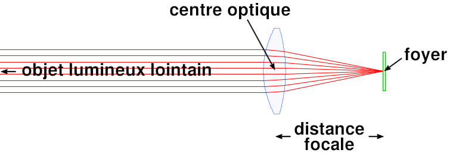
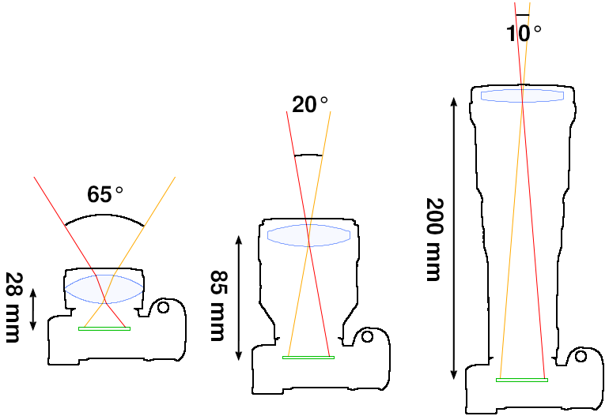

# Distance focale

## Qu'est ce que c'est ?

La distance focale est une des caractèristiques principale d'un objectif.
Elle va permettre de définir le niveau de "zoom" de celui-ci.

Techniquement, elle correspond à la distance entre le centre optique de l'objectif et le foyer de l'image (le capteur de notre appareil).

## Quelles sont les conséquences sur notre photo ?

## Quel type de focale utiliser dans quelle conditions ?

## Zoom vs focale fixe

## Format de capteur et focale
