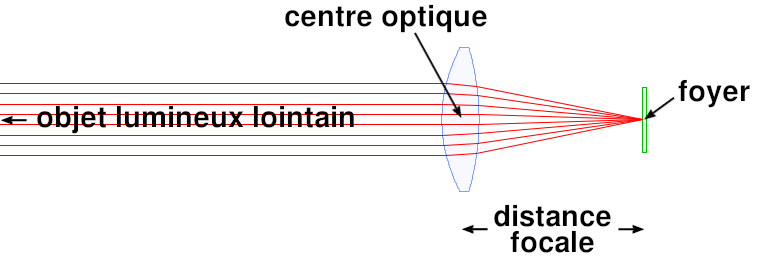
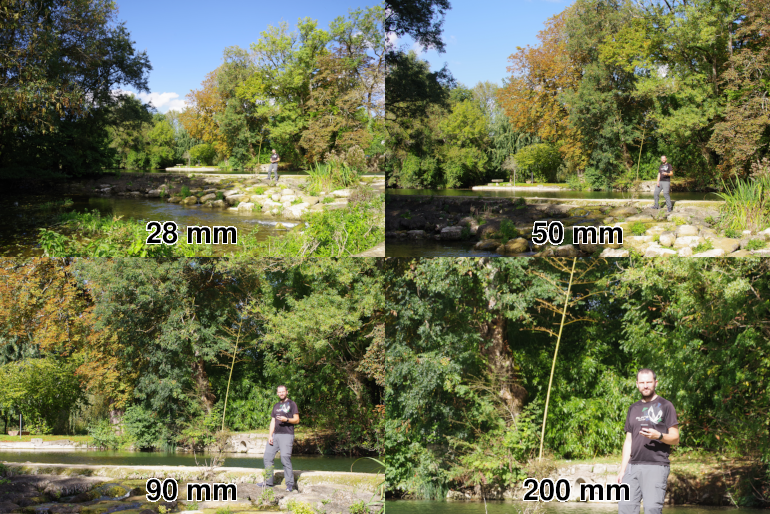

# Longueur focale

## Introduction

Généralement abrégée en "focale", la longueur focale d'un objectif est la caractéristique la plus importante de celui-ci car elle est celle qui aura la plus grande influence sur notre photo.

## Qu'est-ce que c'est ?

En termes purement tehcnique, elle correspond à la distance entre le centre optique de notre objectif et le foyer de notre image (ici, le capteur de notre appareil photo).

Elle est exprimée en mm.

## Quelles sont les conséquences sur notre photo ?

La focale d'un objectif va donc permettre de définir le champ couvert par celui-ci.

Plus la focale sera longue, plus le champ couvert sera étroit.

La conséquence sur notre photo immédiate.

## Grand angle et téléobjectif

### Classique

Les focales situées entre 40 et 85mm sont proches de la vision naturelle de l'oeil humain et sont considérées comme classiques.

### Grand angle

En dessous de 40mm, on rentre dans la catégorie des objectif Grand Angle. Le champ couvert par l'objectif est de plus en plus large. La photo montre plus d'éléments périphériques. Les distances paraissent plus importantes et l'arrière plan semble très éloigné.

#### Cas particulier de l'Ultra Grand Angle (UGA)

En dessous de 25mm, on entre dans un nouvel univers, les perspectives sont totalement faussées et spectaculaires, entrainant des photos qui ne parraissent plus du tout naturelles.

> insérer photo faite l'UGA

## Téléobjectif

## Quel type de focale utiliser dans quelle conditions ?

## Zoom vs focale fixe

## Format de capteur et focale
