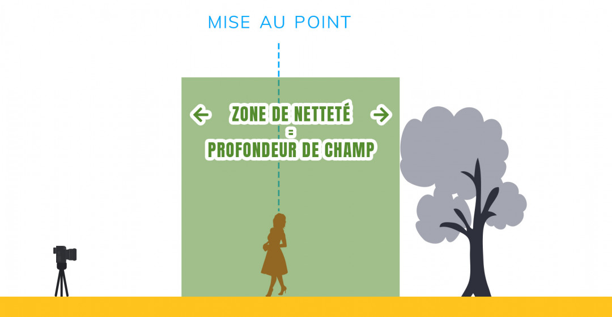
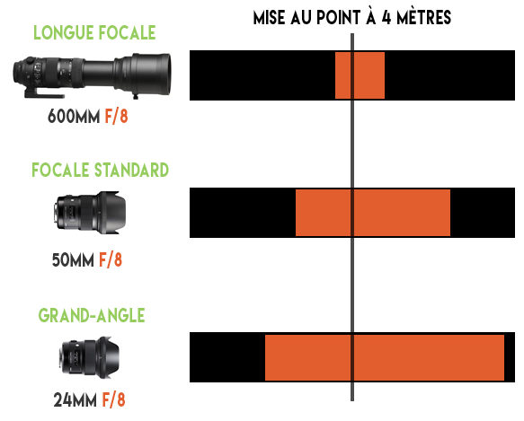
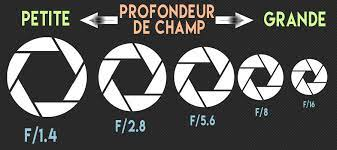

# [Photos focus - Profondeur de champ](../README.md)

## Qu'est ce que c'est ?

En photographie, la profondeur de champ désigne la zone de netteté autour du point sur lequel on fait la mise au point.
Une grande profondeur de champ se caractérise par des images qui sont nettes du début à la fin.
Elle sera particuliérement utilisée pour de la photo de paysage par exemple.

Une faible profondeur de champ aménera au contraire des zones de mise au point relativement petite, aidant à mettre en avant le sujet qui sera de fait isolé par le flou qui apparaittra sur les autres plans.

On l'utilisera typiquement sur de la photo de portrait pour bien détacher le sujet de l'arrière plan.

## Quelle est son importance ?

Elle a une importance cruciale car, au délà de l'aspect artistique, elle permet au photographe de choisir de quelle manière il va présenter son sujet et les éléments qu'il veut mettre en valeur sur son cliché.

Le choix de la profondeur de champ appropriée sur votre photo peut faire une énorme différence.

## Les parametres qui influent sur la profondeur de champ ?

3 paramètres jouent dans l'obtention de la profondeur de champ souhaitée.
En photographie, beaucoup de choses sont affaire de compromis. La profondeur de champ n'echappe pas à cettte regle : le résultat final sera défini par la manière dont on gérera ceux-ci ensemble.

* ### La focale utilisée

Plus la focale de l'objectif que vous utiliserez sera longue, plus la profondeur de champ résultante sera faible.

C'est, par exemple, une des raisons pour lesquelles les photos de sport prises à grande distance (ex : terrain de football) ont une profondeur de champ très fabile.

[Fiche sur la distance focale](focale.md)

* ### L'ouverture du diaphragme

Plus l'ouverture du diaphragme sera grande, plus la profondeur de champ sera faible.
C'est une des raisons pour lesquelles on privilégiera les objectifs avec une grande ouverture dans la photo de portrait.

* ### La distance de mise au point

Plus vous serez proche du sujet sur lequel vous faites la mise au point, plus la profondeur de champ sera faible.
C'est la raison pour laquelle la profondeur de champ était toujours extrémement faible en macrophotographie, les distances étant très courtes (quelques dizaines de cm tout au plus).

## Liens

[DOF Simulator : simulateur de profondeur de champ](https://dofsimulator.net/en/)
